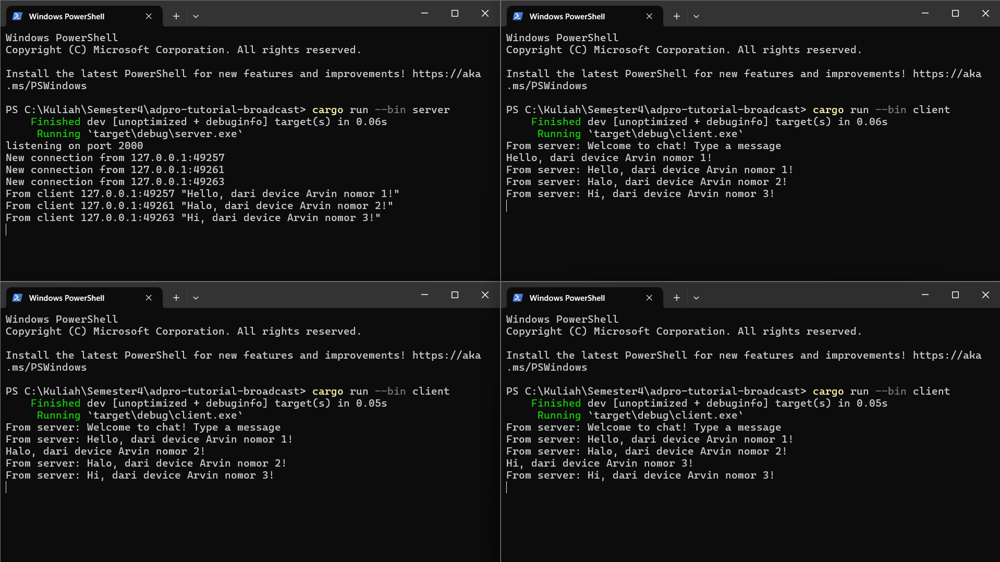
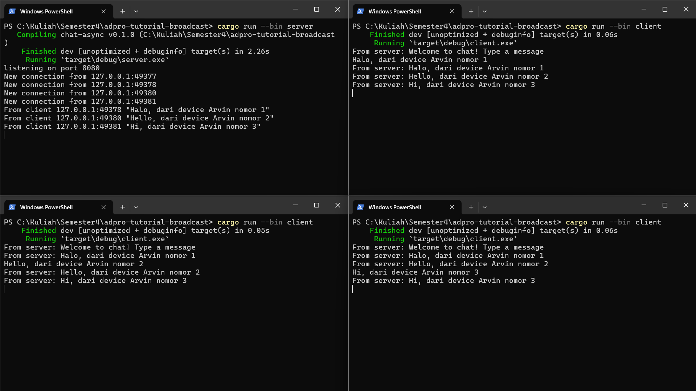
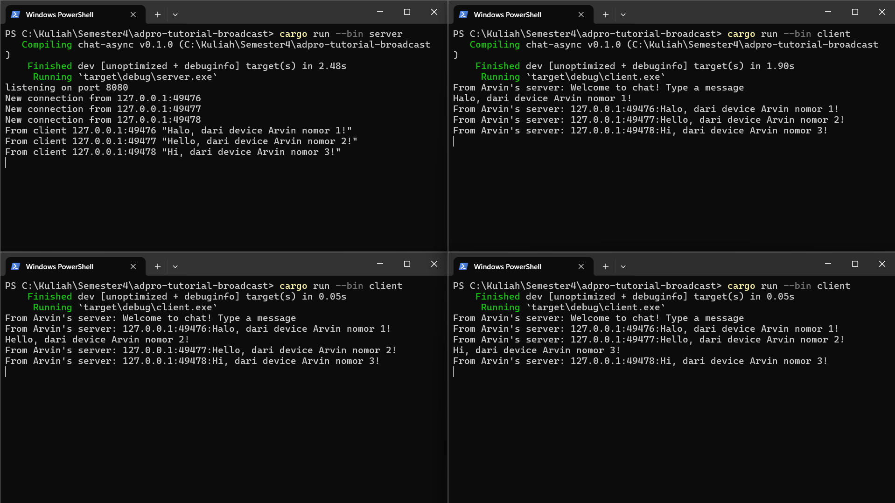

### Result

Client dapat mengirimkan pesan ke server. Kemudian, server menerima pesan dan membagikannya ke client lainnya dalam bentuk broadcast. Maka dari itu, ketika client mengirim pesan maka client lainnya dapat melihatnya. 

Ketika ingin mengubah host atau port dari websocket yang kita punya, maka client dan server harus dipastikan sudah merubah tempat mereka menerima pesan tersebut. Dengan kata lain, server dan client harus menggunakan websocket di tempat yang sama. Jika tidak, maka client tidak akan bisa terhubung ke server. 

Saya mengubah format dari informasi yang dikirimkan client ke server, dari semula yang hanya berisi text pesan menjadi informasi pengirim dan pesannya. Kemudian, server akan membagikan informasi tersebut ke client lainnya.